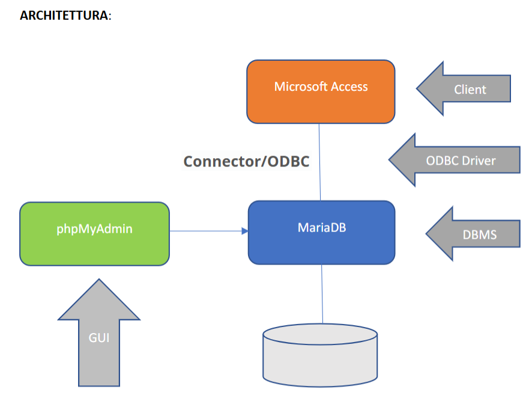
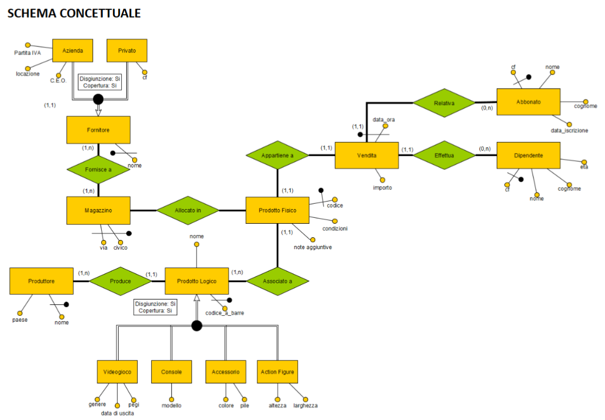
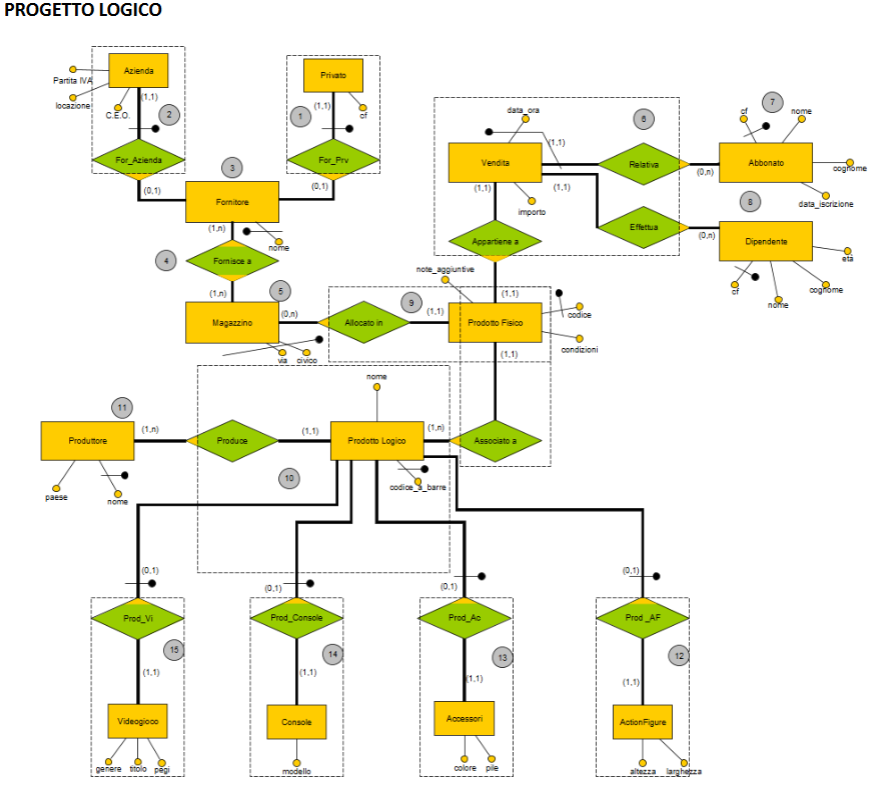
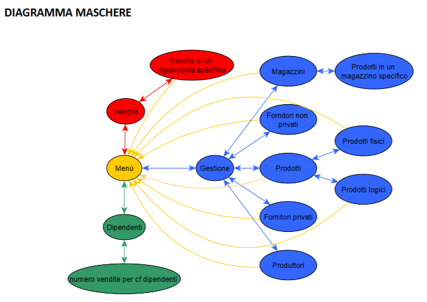

**L'architettura del sistema** per la gestione della base di dati si articola su più livelli interconnessi. 

Il cuore del sistema è il **DBMS (Database Management System) MariaDB** , adibito alla gestione e all'archiviazione dei dati. **L'accesso al database** avviene tramite due interfacce principali: da un lato, l'amministrazione grafica e la gestione tramite GUI (Graphical User Interface) è garantita da **phpMyAdmin**, che si collega direttamente a MariaDB ; dall'altro, il Client designato per l'utente finale è **Microsoft Access**. La comunicazione tra il client Microsoft Access e il DBMS MariaDB è abilitata da un Connector/ODBC, un componente software che agisce come ODBC Driver per stabilire una connessione standardizzata e assicurare il flusso di informazioni tra l'applicazione front-end e il database back-end.

L'acronimo **ODBC** sta per **Open Database Connectivity** e rappresenta un API che consente alle applicazioni, come il **Client** designato **Microsoft Access**, di accedere ai dati del DBMS come **MariaDB** senza dover conoscere i dettagli specifici del driver del database stesso permettendo al client di inviare query al database relazionale **MariaDB** e di ricevere i risultati, assicurando così la piena funzionalità dell'applicativo pur mantenendo i due sistemi separati a livello logico e fisico.

***

## Specifiche del Progetto e Modello dei Dati

Il progetto consiste in un'applicazione focalizzata sulla gestione dei **prodotti** di un **negozio di videogiochi**. Le specifiche definiscono una distinzione fondamentale tra **prodotto logico** e **prodotto fisico**. Il **prodotto logico** è l'astrazione, identificato univocamente da un **codice a barre**, e si suddivide in categorie: **action figure**, **videogiochi**, **console** e **accessori**. È specificato inoltre il **produttore** per ogni prodotto logico. Il **prodotto fisico** è l'istanza del prodotto logico e contiene informazioni specifiche come le **condizioni** e le **note aggiuntive**.

La gestione dei flussi si estende ai **Fornitori**, che si distinguono in **privati** (identificati dal **codice fiscale**) e **aziende** (identificate dalla **Partita IVA**). Ogni fornitore può rifornire qualsiasi **magazzino**. Le **Vendite** rappresentano un altro elemento cardine, possono essere indirizzate a un **abbonato** o a un cliente generico, ma devono essere sempre convalidate da un **dipendente**. Ogni vendita traccia parametri essenziali come l'**importo**, la **data e ora** e il riferimento al **prodotto fisico** ceduto, monitorando lo **storico delle vendite** del negozio.

***

## Schema Concettuale e Progetto Logico

I modelli concettuali e logici riflettono le specifiche del problema. Nello **Schema Concettuale Ristrutturato**, le entità **Fornitore** e **Prodotto Logico** presentano una struttura di **specializzazione/generalizzazione** totale e disgiunta (copertura e disgiunzione 'Si'). Il **Prodotto Logico** si specializza nelle quattro categorie. L'entità **Vendita** è associata a **Prodotto Fisico** (relazione **1:1**), a **Dipendente** (**1:n**), e a **Abbonato** (**0:n**), indicando che la vendita di un prodotto fisico è effettuata da un dipendente e può essere relativa a un abbonato o meno.

Il **Progetto Logico** traduce queste relazioni in tabelle SQL con **chiavi primarie** e **chiavi esterne**; ad esempio, le specializzazioni **Privato** e **Azienda** ereditano la chiave primaria **ID Fornitore** dalla superclasse **Fornitore**. La tabella **Vendita** include le chiavi esterne **ID\_prodotto\_fisico**, **ID\_abbonato** (che può essere nullo) e **ID\_dipendente** per collegarsi alle rispettive entità. Le tabelle delle sottoclassi di prodotto logico (**Action figure**, **Videogioco**, **Console**, **Accessorio**) utilizzano l'attributo **ID prodotto logico** come chiave primaria e al contempo come chiave esterna che referenzia l'ID della superclasse **Prodotto logico**.

***

## Diagramma Maschere e Query SQL

Il **Diagramma Maschere** rappresenta le azioni che l'utente può compiere, partendo dalla pagina iniziale, il **Menu** si può procedere in tre aree funzionali principali:

1.  **Dipendenti**: Permette la visione della lista dei dipendenti e l'esecuzione di una query per visualizzare il **numero vendite per cf dipendenti**.
2.  **Vendite**: Consente di visualizzare lo storico completo delle vendite e di ricercare vendite specifiche tramite l'**ID del dipendente** che le ha effettuate.
3.  **Gestione**: Maschera principale per monitorare la logistica, che include **Magazzini**, **Prodotti** (logici e fisici), **Produttori** e **Fornitori** (privati e non privati), permettendo anche la ricerca di **prodotti fisici** in un magazzino specifico.

Il documento presenta un esempio di query scritta in **linguaggio SQL**, denominata **"dipendente Query"**. Questa query ha lo scopo di calcolare il numero totale di vendite (**COUNT (v.ID) AS Numero\_Vendite**) associate a un dipendente specifico, il cui identificativo viene fornito esternamente come parametro **[inserisci codice fiscale]**. La logica si basa su un **JOIN** tra le tabelle **dipendente** e **vendita**, filtrando il risultato in base al **codice\_fiscale** immesso e raggruppando i risultati per l'ID del dipendente.