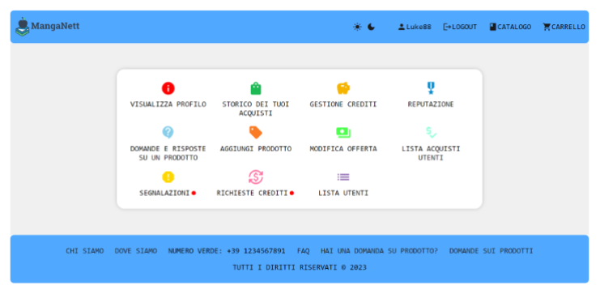
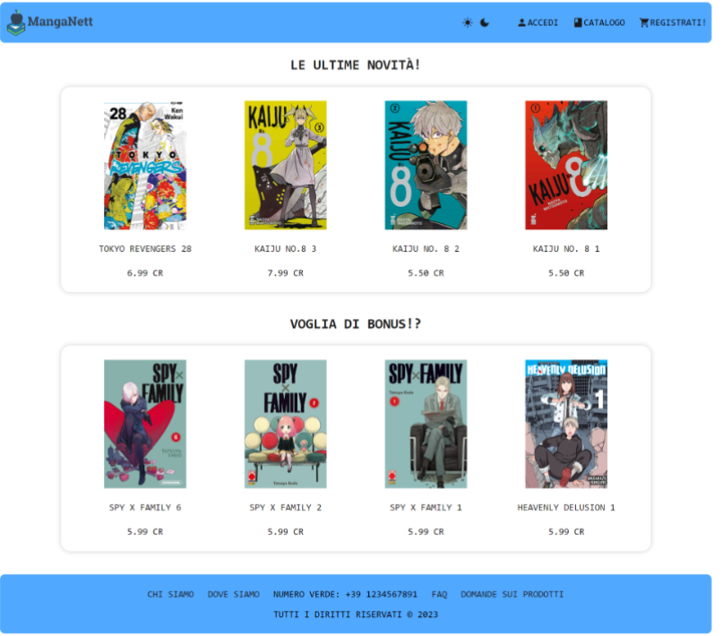

## Tesina per il corso di Linguaggi Web

Luca Privitera - 1938225
link: https://github.com/Luke-1310/LWEB-2022-2023/tree/main/Tesina

**Installazione**:
Per poter utilizzare correttamente il sito web bisogna installare il database "db_tesina", e per fare ciò bisogna utilizzare il file "install.php", una volta avviato si verrà reindirizzati in "homepage.php".

Per poter consultare la documentazione basta visionare il file "Specifiche_Progetto_LWEB.pdf".

🍀

***

## Introduzione a XAMPP, Apache e MySQL

Per lo sviluppo del progetto è stato utilizzato **XAMPP**, un pacchetto software gratuito e open source che fornisce un ambiente locale per la creazione e il test di applicazioni web, all’interno del quale sono inclusi diversi strumenti fondamentali:

* **Apache**, un server web che gestisce le richieste HTTP e consente di visualizzare le pagine web nel browser. È inoltre responsabile dell’**interpretazione del linguaggio PHP**, eseguendo il codice sul server e restituendo al browser solo l’output finale, come pagine HTML o risultati di query.

* **MySQL**, un sistema di gestione di database relazionali utilizzato per memorizzare e gestire i dati degli utenti e del sito.

XAMPP include anche **phpMyAdmin**, un’interfaccia web che permette di gestire facilmente i database MySQL in modo grafico, senza dover scrivere manualmente le query SQL.

***

## Descrizione generale

Il progetto consiste nella realizzazione di un sito web denominato MangaNett, una piattaforma dedicata alla gestione di un negozio online di manga. Gli utenti possono consultare il catalogo, acquistare prodotti tramite un sistema di crediti e interagire con altri utenti attraverso recensioni, domande e risposte.

## Tipologie di utenti

Il sistema prevede cinque ruoli principali, ognuno con permessi diversi:

- **Visitatore**: può consultare il catalogo, leggere le FAQ e registrarsi.

- **Cliente**: può acquistare manga, scrivere recensioni e domande, votare i contributi, gestire i propri crediti e visualizzare il profilo personale.

- **Gestore**: può aggiungere, modificare o eliminare prodotti dal catalogo, definire sconti e bonus, moderare contributi e visualizzare i profili utenti.

- **Amministratore**: può gestire gli utenti (ban, modifiche, promozioni), accettare richieste di crediti ed elevare domande a FAQ.

- **Superamministratore**: possiede tutti i permessi, compresa la possibilità di retrocedere un amministratore.

## Struttura dei dati

La gestione dei dati avviene tramite due tecnologie principali: SQL e XML.

Con SQL (MySQL) vengono memorizzate le informazioni relative agli utenti, come dati personali, crediti, reputazione, ruolo e stato dell’account mentre con XML vengono invece gestiti i contenuti variabili della piattaforma, tra cui:

- il catalogo dei manga;

- lo storico degli acquisti;

- le richieste di crediti;

- le domande e risposte (Q&A).

Ogni file XML è accompagnato da uno schema XSD per garantire la validazione e la coerenza dei dati.

## Architettura e programmazione

Il progetto è strutturato in più file PHP, CSS e XML, suddivisi tra front-end e back-end.

I file PHP di uso generico comprendono:

- connection.php, per la connessione al database;

- install.php, per la creazione del database e delle tabelle;

- funzioni.php, che raccoglie le funzioni comuni per il caricamento e il calcolo dei dati;

- navbar.php, footer.php e tema.php, che gestiscono l’interfaccia e i temi grafici del sito.

I file front-end comprendono le pagine accessibili dall’utente, come homepage, catalogo, login, area privata, FAQ e altre dedicate a specifiche operazioni (ad esempio l’aggiunta di prodotti o la gestione delle offerte).

Nel file `catalogo.php` è presente una porzione di codice JavaScript, scritta con la libreria **jQuery**, utilizzata per rendere più interattiva la navigazione nel catalogo dei manga.
In particolare, questo script gestisce due funzionalità principali: la **ricerca dei prodotti** e l’**ordinamento del catalogo**.

La prima parte del codice consente di cercare un fumetto all’interno del catalogo in base al titolo. L’utente può digitare il testo nella barra di ricerca oppure cliccare sul pulsante dedicato: in entrambi i casi, i titoli dei manga vengono confrontati con il testo inserito e vengono mostrati solo quelli che contengono la parola cercata, nascondendo gli altri. La ricerca è inoltre **case insensitive**, cioè non fa distinzione tra maiuscole e minuscole, e funziona anche **in tempo reale** mentre l’utente scrive.

La seconda parte del codice riguarda invece l’**ordinamento** dei prodotti. Quando l’utente seleziona un criterio (ad esempio prezzo o data) e preme il pulsante di conferma, la pagina viene ricaricata passando come parametro all’URL il criterio scelto. In questo modo, il file PHP può ordinare i prodotti del catalogo in base alla selezione effettuata dall’utente.

I file back-end contengono la logica applicativa delle varie operazioni, come l’aggiunta o la modifica di prodotti, l’aggiornamento dei profili utente, la conferma degli ordini e la validazione dei file XML.

## Interfaccia utente

L’interfaccia è organizzata per adattarsi al ruolo dell’utente autenticato. L’area privata mostra le funzionalità pertinenti al tipo di utente, come la gestione dei crediti per i clienti o la moderazione dei contenuti per i gestori.

Il sito include un sistema di tema chiaro e scuro, gestito tramite cookie, e un carrello della spesa che controlla automaticamente la disponibilità dei prodotti e i crediti necessari per completare un acquisto.
Sono inoltre presenti sezioni dinamiche per recensioni, domande e votazioni, che permettono agli utenti di interagire e contribuire alla community della piattaforma.

## Funzionalità principali

Il sito consente di visualizzare il catalogo dei prodotti ordinandoli per nome, prezzo, editore o data di uscita.
Sono previste due tipologie di sconto: uno generico e uno parametrico, quest’ultimo basato su criteri come anzianità, reputazione o crediti spesi.

Il sistema dei crediti consente agli utenti di effettuare acquisti e di richiederne di nuovi all’amministratore, che può accettare o rifiutare la richiesta.
Ogni utente ha una reputazione, calcolata in base alle valutazioni ricevute sui propri contributi.

Il sito include inoltre la possibilità di moderare contenuti segnalati e di elevare domande e risposte a FAQ, rendendole visibili a tutti gli utenti.